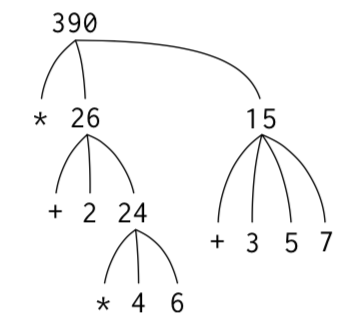

## 第一章 构造过程抽象 (*Chapter 1 Building Abstractions with Procedures*)

> 心智的活动，除了尽力产生各种简单的认识之外，主要表现在如下三个方面：1. 将若干简单认识***组合***为一个复合认识，由此产生出各种复杂的认识；2. 将两个认识放在一起对照，不管它们如何简单或者复杂，在这样做时并不将它们合而为一；由此得到有关它们的***相互关系***的认识；3. 将有关知识与那些在实际中和它们同在的所有其他认识隔离开，这就是***抽象***，所有具有普遍性的认识都是这样得到的。
                                                                - John Locke, An Essay Concerning Human Understanding (1690)

### 一、程序设计的基本元素 (*The Elements of Programming*)

一个强有力的程序设计语言，不仅是一种指挥计算机执行任务的方式，还应该使我们能够在其中组织有关计算过程的思想。这样，当我们描述一个语言的时候，就需要将注意力特别放在语言所提供的，能够将简单的认识组合起来形成更复杂认识的方法方面。每一种强有力的语言都为此提供了三种机制：

* **基本表达式(*primitive expressions*)**: 用于表示语言所关心的最简单的个体。
* **组合的方法(*means of combination*)**: 通过它们可以从较简单的东西出发构造出复合的元素。
* **抽象的方法(*means of abstraction*)**: 通过它们可以为复合对象命名，并将它们当作单元去操作。

在程序设计中，我们需要处理两类要素: **过程和数据 (*procedure and data*)**，**数据(*data*)**是操作的"东西"，**过程(*procedure*)**是有关操作这些数据的规则的描述。

#### 1. 表达式 (*Expressions*)

从键盘输入一个**表达式(*expression*)**，Lisp方言Scheme解释器的响应就是将它对这一表达式的**求值(*evaluating*)**结果显示出来。

```lisp
520
;; 这是一个由数字组成的表达式，表示的是以10作为基数的数。
;; 解释器的响应是打印出: 520
```

如下是**组合式(*combination*)**，其构成方式是用一对括号括起一些表达式，形成一个表(复合表达式)，用于表示一个过程应用。表中最左的元素称为**运算符(*operator*)**，其余元素称为**运算对象(*operand*)**。组合式的值，是通过将由**运算符所刻画的过程**应用于有关的**实际参数(*argument*，即*operand*的值)**而得到的。将运算符放在所有运算对象左边的形式称为**前缀表示(*prefix notation*)**。

```lisp
(+ 150 350)
;; Value: 500

(/ 10 5)
;; Value: 2

(+ 2.7 10)
;; Value: 12.7
```

#### 2. 命名和环境 (*Naming and the Environment*)

Lisp方言Scheme中，使用**`define`**为计算对象命名，命名后的名字标识符称为**变量(*variable*)**，它的**值(*value*)**就是对应的那个对象

```lisp
(define size 5)
size
;; Value: 5
```

我们可以将值和符号关联，而后又能提取这些值，这意味着解释器必须维护某种存储能力，以便保持变量名-变量值的映射关系，这种存储被称为**环境(*environment*)**，更精确的说是**全局环境(*global environment*)**。

#### 3. 组合式的求值 (*Evaluating Combinations*)

求值一个组合式的方式如下:

* 求值该组合式的各个子表达式；
* 将最左子表达式(运算符, *operator*)对应的过程(*procedure*)应用于相应的实际参数，实际参数就是其他子表达式(运算对象, *operands*)的值。

从上述求值组合式的方式，可以看出我们必须先对组合式中的每个元素执行同样的求值过程，这一求值过程是**递归(*recursive*)**的，即它在自己的工作步骤中，包含着调用这个规则本身的需要。

```lisp
(* (+ 2 (* 4 6))
   (+ 3 5 7))
;; Value: 390
```
求值上述表达式，如下图所示，使用一棵树来表示这一组合式的求值过程: 其中每个组合式用一个带分支的节点表示；节点的分支对应组合式中的运算符和各个运算对象；叶子节点(不在发出分支的节点)表示的是运算符或者数值。



以树的观点来看这种求值过程，可以设想那些运算对象的值向上穿行，从叶子节点开始，而后在越来越高的层次中组合起来。"值向上穿行"形式的求值形式是一类更一般的计算过程的一个例子，这种计算过程称为**树状积累(*tree accumulation*)**。

求值组合式的过程中，反复地应用第一个步骤，最终把我们带到的是求值基本表达式(*primitive expression*)而不是组合表达式(*combination*)，如: 数字、内部运算符或者其他名字，上图中的叶子节点+、3、5等等。求值这些基本情况的方式如下:

* 数的值就是它们所表示的数值；
* 内部运算符的值就是能完成相应操作的机器指令序列；
* 其他名字的值就是在环境中关联于这一名字的那个对象。
