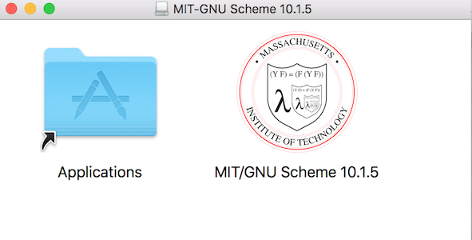

## MIT-Scheme在Mac OS上安装

[MIT/GNU Scheme](http://www.gnu.org/software/mit-scheme/)是Scheme编程语言的一个实现，提供了一个解释器，编译器，源代码调试器，集成的类Emacs编辑器和一个大型运行时库。

下面简单描述如何在Mac OS系统上安装MIT/GNU Scheme:

### 1. 安装

笔者MacBook是64位系统，系统版本是macOS(10.13.6)。MIT-Scheme的最新版本是10.1.9，要求macOS最低是10.14，因此选择下载[10.1.5版本](http://ftp.gnu.org/gnu/mit-scheme/stable.pkg/10.1.5/)。

双击下载下来的`mit-scheme-10.1.5-x86-64.dmg`文件，将`MIT/GUN Scheme 10.1.5`文件拖到`Applications`文件夹中即可安装成功。



为了能方便的从命令行启动MIT-Scheme，我们需要做如下操作:

```shell
sudo ln -s /Applications/MIT:GNU\ Scheme\ 10.1.5.app/Contents/Resources /usr/local/lib/mit-scheme-x86-64

sudo ln -s /usr/local/lib/mit-scheme-x86-64/mit-scheme /usr/local/bin/scheme
```

在输入上面两个命令可能需要输入用户密码，操作完成后就可以从命令行输入`scheme`来启动了，如下所示:

```shell
scheme
```
```shell
MIT/GNU Scheme running under OS X
Type `^C' (control-C) followed by `H' to obtain information about interrupts.

Copyright (C) 2019 Massachusetts Institute of Technology
This is free software; see the source for copying conditions. There is NO warranty; not even for MERCHANTABILITY or FITNESS FOR A PARTICULAR PURPOSE.

Image saved on Saturday January 26, 2019 at 4:09:08 PM
Release 10.1.5 || Microcode 15.3 || Runtime 15.7 || SF 4.41 || LIAR/x86-64 4.118

1 ]=>
```

### 2. 添加rlwrap

MIT-Scheme不支持方向键导航，使用方向键时候会出现乱码，如果我们发现前面有个字符输错了，就得删掉后面已经输入的内容，重新输入整个命令。而且MIT-Scheme 没有提供记忆历史输入的功能，不能通过上下键在多次输入命令间移动。

```shell
# 想通过左键导航到前面的字符时，会出现乱码^[[D
1 ]=> (define (sqr x) (x^[[D

# 想通过上键获取记忆的命令是也会出现乱码^[[A
1 ]=>  ^[[A
```

我们使用`rlwrap`来武装MIT-Scheme，`rlwrap`支持历史记录、Tab键补全、方向键导航等功能，安装方式如下所示:

```shell
brew install rlwrap
```

安装完成后，使用如下命令启动MIT-Scheme:

```shell
# 创建文件.scheme_completion.txt
touch "$HOME"/.scheme_completion.txt

rlwrap -r -c -f "$HOME"/.scheme_completion.txt scheme
```

每次要输入这么长的命令，也很麻烦，所以我们在`~/.bash_profile`文件中(如果你使用的是其他shell，例如[oh-my-zsh](https://github.com/robbyrussell/oh-my-zsh)，请修改相应的配置文件)中添加如下命令:

```shell
alias scheme-rlwrap='rlwrap -r -c -f "$HOME"/.scheme_completion.txt scheme'
```

这样我们就可以在命令行中就可以使用`scheme-rlwrap`来代替`rlwrap -r -c -f "$HOME"/.scheme_completion.txt scheme`启动MIT-Scheme了:

```shell
scheme-rlwrap
```
```shell
MIT/GNU Scheme running under OS X
Type `^C' (control-C) followed by `H' to obtain information about interrupts.

Copyright (C) 2019 Massachusetts Institute of Technology
This is free software; see the source for copying conditions. There is NO warranty; not even for MERCHANTABILITY or FITNESS FOR A PARTICULAR PURPOSE.

Image saved on Saturday January 26, 2019 at 4:09:08 PM
  Release 10.1.5 || Microcode 15.3 || Runtime 15.7 || SF 4.41 || LIAR/x86-64 4.118

1 ]=>
```
