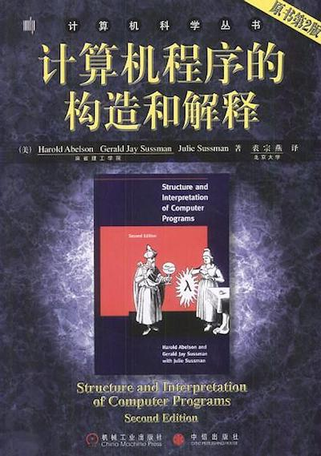

## Structure and Interpretation of Computer Programs

### 1. Prepare

* 王垠: [如何掌握所有的程序语言](http://www.yinwang.org/blog-cn/2017/07/06/master-pl)
* [向热爱计算机科学的你推荐SICP](http://www.nowamagic.net/librarys/veda/detail/1905)
* [Scheme入门教程](https://deathking.github.io/yast-cn/)
* [The SICP Picture Language](http://planet.racket-lang.org/package-source/soegaard/sicp.plt/2/1/planet-docs/sicp-manual/index.html)
* [MIT Scheme在Mac OS上安装](./_Attachments/Installing_MIT_Scheme_on_MacOS.md)

### 2. Videos

* [MIT CS公开课：计算机程序的构造和解释](https://www.bilibili.com/video/av8515129/)

### 3. References

* 原书PDF版(英文): [Structure and Interpretation of Computer Programs](./_Attachments/SICP.pdf)
* [MIT SICP Web Site](http://mitpress.mit.edu/sicp)
* [SICP-Solutions](http://community.schemewiki.org/?SICP-Solutions)
* [SICP 解题集](https://sicp.readthedocs.io/en/latest/)

